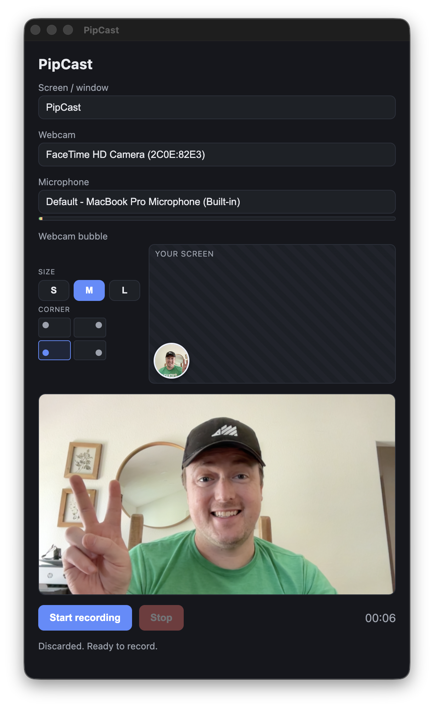

# PipCast

A minimal, Loom-style screen + webcam recorder built with Electron. Capture a screen or window with your webcam composited as a circular bubble in the corner, review the take, and save it as an MP4.

<p align="center">
  
</p>

## Features

- Record any screen or window with a live webcam bubble overlay
- Pick the bubble's size and which corner it sits in
- Choose your camera and microphone, with a live self-view and mic level meter
- 3-2-1 countdown, pause/resume, and a review step before saving
- Saves MP4 directly when the runtime supports it, otherwise transcodes from WebM with a bundled FFmpeg
- Remembers your camera, mic, bubble size, and corner between sessions

## Requirements

- [Bun](https://bun.sh) (used as the package manager and script runner)
- macOS is the primary target. On macOS you must grant **Screen Recording**, **Camera**, and **Microphone** permission to the app.
- Windows is supported and can be packaged as a standalone portable `.exe` — see [Building a standalone Windows app](#building-a-standalone-windows-app).

## Getting started

New to the project? Follow these steps to go from nothing to a running app.

### 1. Install Bun

PipCast uses [Bun](https://bun.sh) as its package manager and script runner. If you don't have it yet:

```bash
curl -fsSL https://bun.sh/install | bash
```

Restart your terminal, then confirm it's installed:

```bash
bun --version
```

### 2. Clone the repository

```bash
git clone https://github.com/sethdavis512/pipcast.git
cd pipcast
```

### 3. Install dependencies

```bash
bun install
```

This also downloads the bundled FFmpeg binary (`ffmpeg-static`) used for WebM-to-MP4 transcoding.

### 4. Start the app

```bash
bun run dev
```

An Electron window opens with hot reload enabled — edits to the source refresh the app automatically.

### 5. Grant permissions (macOS)

On first launch, macOS prompts for **Camera** and **Microphone** access — accept both. **Screen Recording** can't be granted from a prompt, so:

1. Open **System Settings → Privacy & Security → Screen Recording**.
2. Enable **PipCast** (or **Electron** while running in development).
3. Quit and relaunch the app.

If the permission is missing, the app shows an in-window hint with a button that deep-links straight to the right settings pane, plus a **Retry** button once you've granted it.

You're ready — see [Usage](#usage) to record your first take.

## Usage

1. Pick a screen or window, then a camera and microphone.
2. Adjust the webcam bubble size and corner.
3. Click **Start**, wait for the countdown, and record. Use **Pause** / **Resume** as needed.
4. Click **Stop** to review the take, then **Save**, **Re-record**, or **Discard**.

## Scripts

| Command | Description |
| --- | --- |
| `bun run dev` | Start the app in development with hot reload |
| `bun run build` | Type-check and bundle for production into `out/` |
| `bun run build:win` | Bundle and package a standalone Windows portable `.exe` into `dist/` |
| `bun run preview` | Run the production build locally |
| `bun run typecheck` | Type-check without emitting |

## Building a standalone Windows app

PipCast packages into a single portable `.exe` (no installer, no admin rights — run it from anywhere) via [electron-builder](https://www.electron.build).

Build **on Windows**, not under WSL/Linux. The bundled FFmpeg (`ffmpeg-static`) downloads a platform-specific binary at install time, so installing on Windows is what fetches the Windows ffmpeg that ends up in the package.

```powershell
git clone https://github.com/sethdavis512/pipcast.git
cd pipcast
bun install
bun run build:win
```

The portable executable lands in `dist/` as `PipCast-<version>-portable.exe`. ffmpeg is unpacked alongside the app (`app.asar.unpacked`) so the WebM→MP4 fallback works from the packaged build.

To brand the executable, drop a 256×256 (or larger) `build/icon.ico` in place before building — electron-builder picks it up automatically. Without it, the default Electron icon is used.

### Building in CI

You don't need a Windows machine — GitHub Actions builds the exe on a Windows runner:

- **[`build-windows.yml`](.github/workflows/build-windows.yml)** — runs on demand (Actions → *Build Windows* → *Run workflow*) or when you push a `v*` tag. It uploads the portable exe as a workflow artifact, and on a tag also attaches it to a GitHub Release.
- **[`ci.yml`](.github/workflows/ci.yml)** — runs `typecheck` + `test` on every push to `main` and on PRs.

To cut a release:

```bash
git tag v0.1.0
git push origin v0.1.0
```


## How it works

PipCast composites the screen and webcam onto a canvas each frame and records that canvas stream alongside the microphone track. The Electron main process owns screen-source selection, permissions, settings, and the save/transcode pipeline; the renderer drives the UI and media capture through a small typed IPC bridge. See [CLAUDE.md](CLAUDE.md) for an architecture overview.

## License

[MIT](LICENSE)
